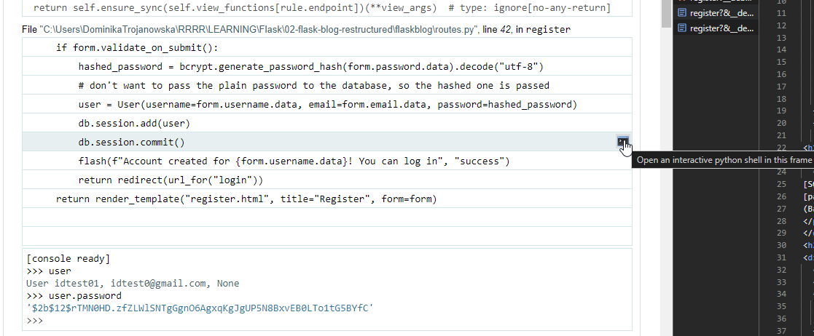

# Flask

## Run application

### 1st approach
```bash
flask --app minimal-app run
```

Where:

- `--app name_of_app` - if the main script is called differently than app.py or wsgi.py

- `--host=0.0.0.0` - to make the server publicly available, this tells to the operating system to listen on all public IPs

- ` --debug` - debug mode reloads the server after changes in the code and shows an interactive debugger in the browser (if error occures), another possibilities to run in debug mode: 

### 2nd approach

```bash
export FLASK_APP=main_file_name.py
export FLSK_DEBUG=1

flask run
```
Use set instead of export for Windows terminal

### 3rd approach

Add inside main file:
```python
if __name__ == "__main__":
    app.run(debug=True)
```

and in console:
```bash
python main_file_name.py
```

## Debugging

When starting the application debugger PIN is received:
```cmd
$ python run.py
 * Serving Flask app 'flaskblog'
(...)
 * Debugger is active!
 * Debugger PIN: 496-693-038
```
It can be used it the browser to debug with interactive Python shell for each frame:  
  
Providing that PIN enables to reach all the frame data - like user, its password hash etc. It's defenitely to much, so debug mode shouldn't go to production!


## render_template()

```python
render_template("home.html", posts=data, )
```
`posts` - this variable is accesible inside the html template via:
- `` - code block
- `{{ post.title }}` - variable
This is a Jinja2 syntax.


## url_for()

Is good to use it for as many routs in the app as possible (if they exists) 
- why?
- what does it do??
- how is ot available in layout.html??

__Pass the name of the route function not the decorator argument__

Usage:
- anchor tags inside html 


## hidden_tag()

FlaskForm method, adds the CSRF token (something related to the user session).
This is part of the same protection as `app.config["SECRET_KEY"]`


## models' method: validate_field(self, field)

Deafult validator for model fields
```python
def validate_username(self, username):
    user = User.query.filter_by(username=username.data).first()
    if user:
        raise ValidationError("That username already exsits")
```

## POST method

Posting a form requiers accepting POST request in a route. If this is not set posting will return `Method Not Allowed` page

## SQL Alchemy Database

### Required - create empty database

```
conda install flask-sqlalchemy
```

main app file:
```python
from flask_sqlalchemy import SQLAlchemy
...
app.config["SQLALCHEMY_DATABASE_URI"] = "sqlite:///site.db"
db = SQLAlchemy(app)
```

#### 1st approach
main app file, right after db instatiation:
```
app.app_context().push()
```

command line - open Python terminal within environment:
```python
from app import app, db
db.create_all()
```
_app is the name of the application main file (I guess)_

#### 2nd approach

command line - open Python terminal within environment:
```python
from app import app, db
with app.app_context():
    db.create_all()
```
_app is the name of the application main file (I guess)_

#### 3rd approach
main app file, just before app.run():
```
if __name__ == "__main__":
    with app.app_context():
        db.create_all()
    app.run()
```

### 
No errors means it's fine. After that the `/instance/site.db` is be created.

### Fill database

Within environment open Pytahon console or better `flask shell`:
```python
from app import User, Post

user2 = User() 
user2.username = "Adam"
user2.email = "Adam@gail.com"    
user2.pasword = "Adam@gail.com" 
user2  # User Adam, Adam@gail.com, None
db.session.add(user2) 
db.session.commit()

user1 = User() 
user1.username = "Corey"
user1.email = "Corey@gail.com"    
user1.pasword = "Corey@gail.com" 
db.session.add(user1) 
db.session.commit()
user1.id
2

from datetime import datetime
post1 = Post()
post1.title = "żaby"
post1.content = "to płazy"
post1.date_posted = datetime.now()
post1.user_id = 1
post1 # User żaby, 2024-07-01 17:25:56.164896, to płazy
db.session.add(post1)
db.session.commit()

User.query.all()
# [User Adam, Adam@gail.com, default.jpeg, User Corey, Corey@gail.com, default.jpeg]
Post.query.all() 
# [User żaby, 2024-07-01 17:25:56.164896, to płazy]

User.query.first()
# User Adam, Adam@gail.com, default.jpeg


User.query.filter_by(username="Corey").all()
# [User Corey, Corey@gail.com, default.jpeg]

User.query.filter_by(username="Corey").first()
# User Adam, Adam@gail.com, default.jpeg

user = User.query.get(1)  # this is an id
user
# User Adam, Adam@gail.com, default.jpeg

user.posts
# [User żaby, 2024- 07-01 17:25:56.164896, to płazy]

post = Post.query.first()
post.user_id  # 1
post.author # the backref
# User Adam, Adam@gail.com, default.jpeg

# to clear the db:
db.drop_all()
db.create_all()
User.query.all()  # []
Post.query.all()  # []
```


## environment variables on windows powershell
```
:Env:PATH
```